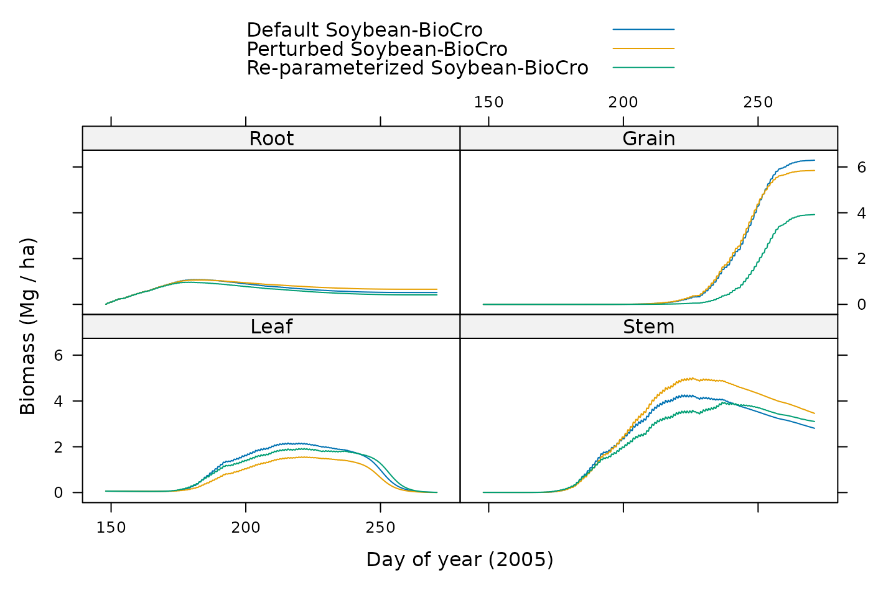

# Parameterizing Soybean-BioCro

## Overview

This article shows how to create an objective function that can be used
to parameterize BioCro’s soybean model ([Matthews et al.
2021](#ref-matthews_soybean_biocro_2021); [Lochocki et al.
2022](#ref-lochocki_biocro_2022)).

Since the original publication of Soybean-BioCro, the BioCro module
library has undergone several changes, and the model has been
re-parameterized several times. These parameterizations did not use
`BioCroValidation`, since they were performed before `BioCroValidation`
was created.

However, `BioCroValidation` is able to re-create the objective functions
that were used for these parameterizations. Here, we re-create the
objective function that was used for the parameterization included in
version `3.2.0` of the BioCro R package.

In the commands below, we will use functions from several libraries, so
we will load them now:

``` r

# Load required libraries
library(BioCroValidation)
library(BioCro)
library(dfoptim)
library(lattice)
```

## Building the Objective Function

In this section, we will use the `objective_function` function from
`BioCroValidation` package to create an objective function that can be
used to parameterize Soybean-BioCro. For more details about this, please
see the help page for `objective_function` by typing
[`?objective_function`](https://biocro.github.io/BioCroValidation/reference/objective_function.md)
from an R terminal.

### The Base Model Definition

We first need a base model definition that includes the necessary
modules, initial values, parameters, and differential equation solver
specifications. For this example, we will simply use Soybean-BioCro as
the base model, with just one small change: we will use an Euler solver
rather than the default solver, which will help make the optimization
run faster. For reasonable sets of parameter values, the Euler solver
does not seem to cause any substantial errors when running
Soybean-BioCro.

``` r

# Specify the base model definition
base_model_definition            <- soybean
base_model_definition$ode_solver <- default_ode_solvers[['homemade_euler']]
```

### The Observed Data

The observed data needed to parameterize Soybean-BioCro is included in
the `BioCroValidation` package as the `soyface_biomass` data set, which
consists of two years (2002 and 2005) of biomass data and associated
standard deviations, included in four separate tables. However, each
table requires some pre-processing to get it ready.

One issue is that the data set specifies the doy of year (DOY) for each
harvest, but we need to specify the time using BioCro’s convention (the
number of hours since the start of the year).

Another issue is that the data set includes pod and seed values, but
Soybean-BioCro calculates shell and seed masses, where the shell and
seed together comprise the pod.

Although the observations do not include root biomass, it is
nevertheless important to constrain the predicted root mass to
reasonable values. To do this, it is assumed that the maximum root mass
is seventeen percent of the maximum aboveground biomass, and that it is
achieved at the same time as maximum above-ground biomass, based on
observations reported in Ordóñez et al.
([2020](#ref-ordonez_root_2020)). In the observed data, the sum of stem
and leaf mass is largest at the fifth time point in both years. So, root
mass is estimated at this single time point and added to the observed
values.

In previous parameterizations, a standard deviation for the root mass
was not explicitly estimated; instead, the standard-deviation-based
weight factor was implicitly set to 1. Because the `'logarithm'` method
with \\\epsilon = 10^{-5}\\ was used, a weight factor of 1 implies a
standard deviation of \\1 / e - 10^{-5} \approx 0.3678694\\. See the
documentation page
([`?objective_function`](https://biocro.github.io/BioCroValidation/reference/objective_function.md))
for more information about this weighting method.

Finally, the data set includes some values that are not needed for the
parameterization. This includes the leaf litter accumulated between each
harvest, as well as the `DOY` and `Rep_Mg_per_ha` columns that have been
superseded by other columns defined above.

Here we will define a helping function that can accomplish the required
modifications described above; note that some operations are different
depending on whether the table represents biomass values or standard
deviations:

``` r

# Define a helping function for processing data tables
process_table <- function(data_table, type) {
  # Define new `time` column
  data_table$time <- (data_table$DOY - 1) * 24.0

  # Define new `Shell_Mg_per_ha` column
  data_table$Shell_Mg_per_ha <- if (type == 'biomass') {
    # The shell is all parts of the pod other than the seed
    data_table$Rep_Mg_per_ha - data_table$Seed_Mg_per_ha
  } else {
    # Add uncertainties in quadrature, a simple approach to error propagation
    sqrt(data_table$Rep_Mg_per_ha^2 + data_table$Seed_Mg_per_ha^2)
  }

  # Define new `Root_Mg_per_ha` column, which has just one non-NA value
  row_to_use <- 5                 # Choose row to use
  data_table$Root_Mg_per_ha <- NA # Initialize all values to NA

  if (type == 'biomass') {
    # Estimate a mass at one time point
    col_to_add <- c(
      'Leaf_Mg_per_ha',
      'Stem_Mg_per_ha',
      'Rep_Mg_per_ha'
    )

    data_table[row_to_use, 'Root_Mg_per_ha'] <-
      0.17 * sum(data_table[row_to_use, col_to_add])
  } else {
    # Estimate standard deviation at one time point
    data_table[row_to_use, 'Root_Mg_per_ha'] <- 1 / exp(1) - 1e-5
  }

  # Remove columns by setting them to NULL
  data_table$DOY              = NULL
  data_table$Rep_Mg_per_ha    = NULL
  data_table$Litter_Mg_per_ha = NULL

  # Return the processed table
  data_table
}
```

### The Drivers

The `BioCro` R package includes weather data for the years in the
`soyface_biomass` data set. However, for one of the years (2005), we
would like to use a different set of precipitation measurements. These
are available in the `soyface_precipitation` data set.

``` r

# Helping function to replace precipitation values
replace_precip <- function(df_orig, df_new) {
  # Make sure df_new does not extend outside the time range of df_orig
  df_new_to_keep <- df_new$doy >= df_orig$doy[1] & df_new$doy <= tail(df_orig$doy, 1)
  df_new <- df_new[df_new_to_keep, ]

  # Overwrite precip in the common time range and return
  df_orig_to_overwrite <- df_orig$doy >= df_new$doy[1] & df_orig$doy <= tail(df_new$doy, 1)
  df_orig$precip[df_orig_to_overwrite] <- df_new$precip
  df_orig
}

# For 2002, we can just use the default weather data
drivers_2002 <- soybean_weather[['2002']]

# For 2005, we overwrite the precipitation values
drivers_2005 <- replace_precip(soybean_weather[['2005']], soyface_precip[['2005']])
```

### The Data-Driver Pairs

So now we are ready to define the data-driver pairs, which includes the
weather, the observed biomass, the standard deviation of the observed
biomass, the atmospheric CO2 concentration to use for each year, and the
weight to assign to each year:

``` r

# Define the data-driver pairs
data_driver_pairs <- list(
  ambient_2002 = list(
    data       = process_table(soyface_biomass[['ambient_2002']],     'biomass'),
    data_stdev = process_table(soyface_biomass[['ambient_2002_std']], 'stdev'),
    drivers    = drivers_2002,
    parameters = list(Catm = with(BioCro::catm_data, {Catm[year == '2002']})),
    weight     = 1
  ),
  ambient_2005 = list(
    data       = process_table(soyface_biomass[['ambient_2005']],     'biomass'),
    data_stdev = process_table(soyface_biomass[['ambient_2005_std']], 'stdev'),
    drivers    = drivers_2005,
    parameters = list(Catm = with(BioCro::catm_data, {Catm[year == '2005']})),
    weight     = 1
  )
)
```

Here we have chosen equal weights for the two years.

### The Post-Processing Function

The observed data includes values of the total litter, which is
comprised of both leaf and stem litter. However, the model does not
calculate this quntity; instead, it returns separate values of leaf and
stem litter. To address this issue, we can provide a “post-processing
function.” This is an (optional) function that is applied to each
simulation result and can be used to add new columns. Here we define
such a function, which adds a new column for the total litter:

``` r

# Define the post-processing function
post_process_function <- function(sim_res) {
  # Calculate the total litter as the sum of leaf and stem litter
  within(sim_res, {TotalLitter = LeafLitter + StemLitter})
}
```

### The Data Definitions

The data sets above have columns whose names do not match the
corresponding model outputs. For example, the `Leaf_Mg_per_ha` column of
the observed data must be compared to the `Leaf` column of the model
output, since both represent the leaf mass per unit ground area. To
handle this mismatch, we can provide a set of “data definitions” that
specify which columns should be compared:

``` r

# Define the data definition list, where the element names are columns in the
# observed data tables, and the element values are the corresponding column
# names in the model outputs
data_definitions <- list(
# Observed               Simulated
  CumLitter_Mg_per_ha = 'TotalLitter',
  Leaf_Mg_per_ha      = 'Leaf',
  Root_Mg_per_ha      = 'Root',
  Seed_Mg_per_ha      = 'Grain',
  Shell_Mg_per_ha     = 'Shell',
  Stem_Mg_per_ha      = 'Stem',
  LAI                 = 'lai'
)
```

### The Arguments to Vary

Here we wish to vary several parameters related to carbon partitioning
for growth, senescence, maintenance respiration, and growth respiration:

- For each growing tissue, there are two parameters (\\\alpha\\ and
  \\\beta\\) that influence the parbon partitioning coefficients. Here
  we will vary these for the leaf, stem, and shell (6 parameters in
  total).

- For each senescing tissue, there are three parameters
  (\\\alpha\_{sen}\\, \\\beta\_{sen}\\, and `rate`) that influence when
  senescence begins and the overall rate of scenescence. Here we will
  vary these for the leaf and stem (6 parameters in total).

- For each growing tissue, there is one parameter (`grc`) that
  influences the rate of carbon use for growth respiration. Here we will
  vary these for the stem and root (2 parameters in total).

- For each tissue, there is one parameter (`mrc`) that influences the
  rate of carbon use for maintenance respiration. Here we will vary
  these for the leaf, stem, and root (3 parameters in total).

Together, this is 17 arguments to vary. Typically, an optimization
problem requires more time for each free parameter involved, so it is
helpful to vary the smallest possible set. One way to reduce the number
of free parameters is to treat some as being “dependent.” In other
words, to calculate the values of some parameters from the values of
others, so that only some of them are truly free or “independent.” Here
we will do this by fixing the value of `mrc_stem` to the value of
`mrc_leaf`. Thus, we can think of this is a single maintenance
respiration coefficient for the entire shoot; this reduces the number of
independent parameters by one (to 16).

The independent arguments must be specified as a list of named numeric
elements, where the name is the argument name and the value is an
initial guess for that argument. Here we will use the default
Soybean-BioCro values as our initial guesses:

``` r

# Define a list of independent arguments and their initial values
independent_arg_names <- c(
  # Partitioning for leaf, stem, and shell
  'alphaLeaf',
  'betaLeaf',
  'alphaStem',
  'betaStem',
  'alphaShell',
  'betaShell',

  # Senescence for leaf and stem
  'alphaSeneLeaf',
  'betaSeneLeaf',
  'rateSeneLeaf',
  'alphaSeneStem',
  'betaSeneStem',
  'rateSeneStem',

  # Growth respiration for stem and root
  'grc_stem',
  'grc_root',

  # Maintenance respiration for leaf and root
  'mrc_leaf',
  'mrc_root'
)

independent_args <- soybean$parameters[independent_arg_names]
```

The dependent arguments must be specified as a function that takes a
list of independent arguments as its input, and returns a list of
dependent arguments as its output:

``` r

# Define a function that sets `mrc_stem` to the value of `mrc_leaf`
dependent_arg_function <- function(ind_args) {
  list(mrc_stem = ind_args[['mrc_leaf']])
}
```

### The Quantity Weights

When determining the error metric value, we wish to assign different
weights to each type of observed value. This can be handled via the
`quantity_weights`, which must be a list of named numeric elements,
where the name of each element is an output from the simulation, and its
value is the weight.

``` r

# Specify the quantity weights; there is no systematic way to determine these,
# but the following weights have worked well in the past for Soybean-BioCro
quantity_weights <- list(
  Grain       = 1.0,
  Leaf        = 1.0,
  Root        = 0.1,
  Shell       = 0.5,
  Stem        = 1.0,
  TotalLitter = 0.1,
  lai         = 1.0
)
```

### The Extra Penalty Function

Sometimes an optimizer may choose parameter values that produce close
agreement with the observed data but are nevertheless unreasonable from
a biological perspective.

To prevent these unreasonable parameters from being chosen, “extra
penalties” can be added to the error metric. These penalties can be
specified using an `extra_penalty_function`, which must take two inputs:
the first is the result of a BioCro simulation for a single year
(typically called `sim_res`) and the second is the observed data for
that year in long form (typically called `long_form_data`). The extra
penalty function must return a numeric error penalty value, which
generally should be zero (when no issues are found) or a large positive
number (if an issue has been found).

For Soybean-BioCro parameterization, four common issues are that:

1.  Carbon is never partitioned to one or more key tissues.

2.  Carbon partitioning to the stem and leaf starts at different times.

3.  Carbon partitioning to the leaves begins too early or too late.

4.  Carbon partitioning to the seed begins too early.

The function below will return a large value when any of these
situations occurs, and will otherwise return a value of zero.

``` r

# Define an extra penalty function
extra_penalty_function <- function(sim_res, long_form_data) {
  # Set the penalty value
  PENALTY <- 9999

  # Get the first times when each partitioning coefficient becomes non-zero
  k_thresh <- 0.01 # Threshold k value to decide when growth has started
  hpd      <- 24.0 # Hours per day

  time <- sim_res[['time']]

  time_grain <- time[sim_res[['kGrain']] > k_thresh][1]
  time_leaf  <- time[sim_res[['kLeaf']]  > k_thresh][1]
  time_shell <- time[sim_res[['kShell']] > k_thresh][1]
  time_stem  <- time[sim_res[['kStem']]  > k_thresh][1]

  # Get the latest time when the observed seed mass is zero
  seed_obs      <- long_form_data[long_form_data[['quantity_name']] == 'Grain', ]
  last_seedless <- max(seed_obs[seed_obs[['quantity_value']] < 0.1, 'time'])

  # Return a penalty if necessary
  if (is.na(time_grain) | is.na(time_leaf) | is.na(time_shell) | is.na(time_stem)) {
    # One or more tissues is not growing
    return(PENALTY)
  } else if (abs(time_leaf - time_stem) > 5 * hpd) {
    # The starts of leaf and stem growth are more than 5 days apart
    return(PENALTY)
  } else if (time_leaf - time[1] > 20 * hpd | time_leaf - time[1] < 10 * hpd) {
    # The start of leaf growth is too late (more than 20 days after sowing) or
    # too early (fewer than 10 days after sowing)
    return(PENALTY)
  } else if (time_grain < last_seedless - 14 * hpd) {
    # Seeds have started growing too early (more than 2 weeks before the last
    # seedless day in the observations)
    return(PENALTY)
  } else {
    # No problems were detected
    return(0.0)
  }
}
```

### The Objective Function

Now we are just about ready to build the objective function. There are a
few more details to discuss:

- Soybean-BioCro has always used the `'mean_max'` method for determining
  normalization factors; see Equations 14-16 of Matthews et al.
  ([2021](#ref-matthews_soybean_biocro_2021)) for more details.

- Soybean-BioCro has always used the `'logarithm'` method for
  determining weights from standard deviations with \\\epsilon =
  10^{-5}\\; see Equation 17 of Matthews et al.
  ([2021](#ref-matthews_soybean_biocro_2021)) for more details.

- Soybean-BioCro has not used any regularization.

With this, it is possible to build the function. Note that some useful
information is printed out when the function is created, such as the
full list of observed values and their corresponding weights.

``` r

# Create the objective function
obj_fun <- objective_function(
  base_model_definition,
  data_driver_pairs,
  independent_args,
  quantity_weights,
  data_definitions       = data_definitions,
  normalization_method   = 'mean_max',
  stdev_weight_method    = 'logarithm',
  stdev_weight_param     = 1e-5,
  regularization_method  = 'none',
  dependent_arg_function = dependent_arg_function,
  post_process_function  = post_process_function,
  extra_penalty_function = extra_penalty_function
)
#> 
#> Driver-specific initial values:
#> 
#>   None
#> 
#> Driver-specific parameters:
#> 
#> List of 2
#>  $ ambient_2002:List of 1
#>   ..$ Catm: num 373
#>  $ ambient_2005:List of 1
#>   ..$ Catm: num 379
#> 
#> The independent arguments and their initial values:
#> 
#> List of 16
#>  $ alphaLeaf    : num 23.4
#>  $ betaLeaf     : num -18.1
#>  $ alphaStem    : num 22.1
#>  $ betaStem     : num -16.2
#>  $ alphaShell   : num 11.5
#>  $ betaShell    : num -8.48
#>  $ alphaSeneLeaf: num 43.8
#>  $ betaSeneLeaf : num -26.7
#>  $ rateSeneLeaf : num 0.00999
#>  $ alphaSeneStem: num 10.9
#>  $ betaSeneStem : num -4.61
#>  $ rateSeneStem : num 0.00216
#>  $ grc_stem     : num 0.0191
#>  $ grc_root     : num 0.0025
#>  $ mrc_leaf     : num 0.000297
#>  $ mrc_root     : num 1e-06
#> 
#> The dependent arguments and their initial values:
#> 
#> List of 1
#>  $ mrc_stem: num 0.000297
#> 
#> The full data definitions:
#> 
#> List of 7
#>  $ Leaf_Mg_per_ha     : chr "Leaf"
#>  $ Stem_Mg_per_ha     : chr "Stem"
#>  $ Seed_Mg_per_ha     : chr "Grain"
#>  $ CumLitter_Mg_per_ha: chr "TotalLitter"
#>  $ LAI                : chr "lai"
#>  $ Shell_Mg_per_ha    : chr "Shell"
#>  $ Root_Mg_per_ha     : chr "Root"
#> 
#> Normalization method: MEAN_MAX with eps = 0.1 
#> 
#> Standard-deviation-based weight method: LOGARITHM with eps = 1e-05 
#> 
#> The user-supplied data in long form:
#> 
#> $ambient_2002
#>     time quantity_name quantity_value quantity_stdev time_index expected_npts
#> 1   4272          Leaf   0.1802843394   0.0408155501        649          3288
#> 2   4512          Leaf   0.5544619422   0.1638632739        889          3288
#> 3   4848          Leaf   1.3265529308   0.1337744335       1225          3288
#> 4   5184          Leaf   1.6979440069   0.2283266576       1561          3288
#> 5   5520          Leaf   1.8077427820   0.2024754215       1897          3288
#> 6   5880          Leaf   1.5788136482   0.0754751654       2257          3288
#> 7   6192          Leaf   0.9475377733   0.3445500325       2569          3288
#> 8   6888          Leaf   0.0000000000   0.0000000000       3265          3288
#> 23  4272          Stem   0.0852449694   0.0170797372        649          3288
#> 24  4512          Stem   0.4188538932   0.1384490248        889          3288
#> 25  4848          Stem   1.7110673664   0.1837107594       1225          3288
#> 26  5184          Stem   2.8928258965   0.4487440652       1561          3288
#> 27  5520          Stem   3.6859142604   0.4534474707       1897          3288
#> 28  5880          Stem   3.7452607171   0.2753213561       2257          3288
#> 29  6192          Stem   3.6184015745   0.1510453777       2569          3288
#> 30  6888          Stem   2.3057012247   0.1483892609       3265          3288
#> 45  4272         Grain   0.0000000000   0.0000000000        649          3288
#> 46  4512         Grain   0.0000000000   0.0000000000        889          3288
#> 47  4848         Grain   0.0000000000   0.0000000000       1225          3288
#> 48  5184         Grain   0.0000000000   0.0000000000       1561          3288
#> 49  5520         Grain   0.0000000000   0.0000000000       1897          3288
#> 50  5880         Grain   2.4803149604   0.3660583625       2257          3288
#> 51  6192         Grain   4.8468941378   0.5144215602       2569          3288
#> 52  6888         Grain   5.4133858263   0.1152608235       3265          3288
#> 67  4272   TotalLitter   0.0000000000   0.0000000000        649          3288
#> 68  4512   TotalLitter   0.0000000000   0.0000000000        889          3288
#> 69  4848   TotalLitter   0.0000000000   0.0000000000       1225          3288
#> 70  5184   TotalLitter   0.0000000000   0.0000000000       1561          3288
#> 71  5520   TotalLitter   0.3818897637   0.0456182275       1897          3288
#> 72  5880   TotalLitter   0.6633127734   0.0676627660       2257          3288
#> 73  6192   TotalLitter   0.9786377952   0.0320523860       2569          3288
#> 74  6888   TotalLitter   2.5831766621   0.2678295161       3265          3288
#> 97  4248           lai   0.8715000000   0.0871500000        625          3288
#> 98  4392           lai   1.3184000000   0.1318400000        769          3288
#> 99  4560           lai   2.1117000000   0.2111700000        937          3288
#> 100 4728           lai   3.0615000000   0.3061500000       1105          3288
#> 101 4896           lai   4.7821000000   0.4782100000       1273          3288
#> 102 5040           lai   5.9218000000   0.5921800000       1417          3288
#> 103 5280           lai   6.7598000000   0.6759800000       1657          3288
#> 104 5448           lai   6.0782000000   0.6078200000       1825          3288
#> 105 5592           lai   6.2346000000   0.6234600000       1969          3288
#> 106 5712           lai   6.3352000000   0.6335200000       2089          3288
#> 107 5928           lai   5.4637000000   0.5463700000       2305          3288
#> 108 6096           lai   4.5587000000   0.4558700000       2473          3288
#> 109 6216           lai   3.4637000000   0.3463700000       2593          3288
#> 110 6408           lai   1.1732000000   0.1173200000       2785          3288
#> 111 4272         Shell   0.0000000000   0.0000000000        649          3288
#> 112 4512         Shell   0.0000000000   0.0000000000        889          3288
#> 113 4848         Shell   0.0003171479   0.0005493162       1225          3288
#> 114 5184         Shell   0.0793963255   0.0309899985       1561          3288
#> 115 5520         Shell   1.5545713035   0.2184025435       1897          3288
#> 116 5880         Shell   1.4956986001   0.6804094230       2257          3288
#> 117 6192         Shell   1.6977565178   0.9040650516       2569          3288
#> 118 6888         Shell   1.5955818021   0.1827578015       3265          3288
#> 137 5520          Root   1.1981988188   0.3678694412       1897          3288
#>            norm      w_var
#> 1     53.886943  3.1984472
#> 2     53.886943  1.8086619
#> 3     53.886943  2.0115255
#> 4     53.886943  1.4769342
#> 5     53.886943  1.5970874
#> 6     53.886943  2.5838191
#> 7     53.886943  1.0654869
#> 8     53.886943 11.5129255
#> 23   226.031645  4.0692772
#> 24   226.031645  1.9771808
#> 25   226.031645  1.6943383
#> 26   226.031645  0.8012803
#> 27   226.031645  0.7908538
#> 28   226.031645  1.2897800
#> 29   226.031645  1.8901088
#> 30   226.031645  1.9078489
#> 45   470.475938 11.5129255
#> 46   470.475938 11.5129255
#> 47   470.475938 11.5129255
#> 48   470.475938 11.5129255
#> 49   470.475938 11.5129255
#> 50   470.475938  1.0049352
#> 51   470.475938  0.6646928
#> 52   470.475938  2.1604709
#> 67   108.364827 11.5129255
#> 68   108.364827 11.5129255
#> 69   108.364827 11.5129255
#> 70   108.364827 11.5129255
#> 71   108.364827  3.0872287
#> 72   108.364827  2.6930715
#> 73   108.364827  3.4400717
#> 74   108.364827  1.3173673
#> 97  1282.257089  2.4400098
#> 98  1282.257089  2.0260904
#> 99  1282.257089  1.5550444
#> 100 1282.257089  1.1836474
#> 101 1282.257089  0.7376844
#> 102 1282.257089  0.5239277
#> 103 1282.257089  0.3915770
#> 104 1282.257089  0.4978600
#> 105 1282.257089  0.4724546
#> 106 1282.257089  0.4564479
#> 107 1282.257089  0.6044406
#> 108 1282.257089  0.7855257
#> 109 1282.257089  1.0602188
#> 110 1282.257089  2.1427648
#> 111   47.718035 11.5129255
#> 112   47.718035 11.5129255
#> 113   47.718035  7.4887956
#> 114   47.718035  3.4737681
#> 115   47.718035  1.5213696
#> 116   47.718035  0.3850459
#> 117   47.718035  0.1008429
#> 118   47.718035  1.6995388
#> 137    3.071361  1.0000000
#> 
#> $ambient_2005
#>     time quantity_name quantity_value quantity_stdev time_index expected_npts
#> 1   4104          Leaf     0.22227188    0.032896589        577          2952
#> 2   4440          Leaf     0.84603750    0.146798299        913          2952
#> 3   4776          Leaf     1.18446563    0.338074288       1249          2952
#> 4   5112          Leaf     2.21805938    0.152175913       1585          2952
#> 5   5448          Leaf     2.14744687    0.119077589       1921          2952
#> 6   5784          Leaf     1.51948125    0.512808699       2257          2952
#> 7   6120          Leaf     0.06575625    0.061686243       2593          2952
#> 8   6456          Leaf     0.00000000    0.000000000       2929          2952
#> 25  4104          Stem     0.18880312    0.014318136        577          2952
#> 26  4440          Stem     0.85220625    0.198830061        913          2952
#> 27  4776          Stem     1.61896875    0.605286253       1249          2952
#> 28  5112          Stem     4.04361563    0.559874052       1585          2952
#> 29  5448          Stem     4.47772500    0.306744644       1921          2952
#> 30  5784          Stem     3.89208750    0.379108485       2257          2952
#> 31  6120          Stem     2.89905000    0.220823981       2593          2952
#> 32  6456          Stem     2.17560000    0.243254729       2929          2952
#> 49  4104         Grain     0.00000000    0.000000000        577          2952
#> 50  4440         Grain     0.00000000    0.000000000        913          2952
#> 51  4776         Grain     0.00000000    0.000000000       1249          2952
#> 52  5112         Grain     0.00000000    0.000000000       1585          2952
#> 53  5448         Grain     0.00000000    0.000000000       1921          2952
#> 54  5784         Grain     3.02249063    0.341714782       2257          2952
#> 55  6120         Grain     3.99820312    0.398956753       2593          2952
#> 56  6456         Grain     4.96564688    0.507224090       2929          2952
#> 73  4104   TotalLitter     0.00000000    0.000000000        577          2952
#> 74  4440   TotalLitter     0.00000000    0.000000000        913          2952
#> 75  4776   TotalLitter     0.00000000    0.000000000       1249          2952
#> 76  5112   TotalLitter     0.06654375    0.063708458       1585          2952
#> 77  5448   TotalLitter     0.18230625    0.056246866       1921          2952
#> 78  5784   TotalLitter     0.33593438    0.073342889       2257          2952
#> 79  6120   TotalLitter     0.86697187    0.214176626       2593          2952
#> 80  6456   TotalLitter     1.14843750    0.246267464       2929          2952
#> 105 3744           lai     0.02750000    0.009574271        217          2952
#> 106 3912           lai     0.14000000    0.021602470        385          2952
#> 107 4080           lai     0.52250000    0.203367500        553          2952
#> 108 4248           lai     1.29250000    0.223065800        721          2952
#> 109 4440           lai     2.79000000    0.613568800        913          2952
#> 110 4608           lai     4.47500000    0.707601600       1081          2952
#> 111 4776           lai     5.53250000    0.573083800       1249          2952
#> 112 4944           lai     6.57000000    0.193563100       1417          2952
#> 113 5136           lai     6.46666700    0.290229800       1609          2952
#> 114 5304           lai     6.59250000    0.052519840       1777          2952
#> 115 5472           lai     5.70250000    0.338070500       1945          2952
#> 116 5592           lai     5.16000000    0.287518100       2065          2952
#> 117 5784           lai     4.92666700    0.445009400       2257          2952
#> 118 5952           lai     3.57750000    0.339546300       2425          2952
#> 119 6096           lai     1.37750000    0.279448900       2569          2952
#> 120 6312           lai     1.03750000    0.283945400       2785          2952
#> 121 4104         Shell     0.00000000    0.000000000        577          2952
#> 122 4440         Shell     0.00000000    0.000000000        913          2952
#> 123 4776         Shell     0.00000000    0.000000000       1249          2952
#> 124 5112         Shell     0.29925000    0.164275197       1585          2952
#> 125 5448         Shell     2.30455312    0.434148074       1921          2952
#> 126 5784         Shell     2.51028750    0.680495513       2257          2952
#> 127 6120         Shell     1.37287500    0.655448433       2593          2952
#> 128 6456         Shell     1.40660625    0.811221494       2929          2952
#> 149 5448          Root     1.51805325    0.367869441       1921          2952
#>            norm      w_var
#> 1     80.316598  3.4140824
#> 2     80.316598  1.9186276
#> 3     80.316598  1.0844600
#> 4     80.316598  1.8826524
#> 5     80.316598  2.1278960
#> 6     80.316598  0.6678329
#> 7     80.316598  2.7855322
#> 8     80.316598 11.5129255
#> 25   322.400339  4.2455301
#> 26   322.400339  1.6152545
#> 27   322.400339  0.5020373
#> 28   322.400339  0.5800256
#> 29   322.400339  1.1817071
#> 30   322.400339  0.9699065
#> 31   322.400339  1.5103441
#> 32   322.400339  1.4136050
#> 49   396.122382 11.5129255
#> 50   396.122382 11.5129255
#> 51   396.122382 11.5129255
#> 52   396.122382 11.5129255
#> 53   396.122382 11.5129255
#> 54   396.122382  1.0737496
#> 55   396.122382  0.9188772
#> 56   396.122382  0.6787827
#> 73    22.702539 11.5129255
#> 74    22.702539 11.5129255
#> 75    22.702539 11.5129255
#> 76    22.702539  2.7532810
#> 77    22.702539  2.8778272
#> 78    22.702539  2.6124734
#> 79    22.702539  1.5409076
#> 80    22.702539  1.4012965
#> 105 1393.953800  4.6476320
#> 106 1393.953800  3.8344848
#> 107 1393.953800  1.5926914
#> 108 1393.953800  1.5002437
#> 109 1393.953800  0.4884466
#> 110 1393.953800  0.3458599
#> 111 1393.953800  0.5567059
#> 112 1393.953800  1.6421001
#> 113 1393.953800  1.2370478
#> 114 1393.953800  2.9463739
#> 115 1393.953800  1.0844712
#> 116 1393.953800  1.2464347
#> 117 1393.953800  0.8096374
#> 118 1393.953800  1.0801155
#> 119 1393.953800  1.2749000
#> 120 1393.953800  1.2589381
#> 121  102.424693 11.5129255
#> 122  102.424693 11.5129255
#> 123  102.424693 11.5129255
#> 124  102.424693  1.8061514
#> 125  102.424693  0.8343466
#> 126  102.424693  0.3849194
#> 127  102.424693  0.4224204
#> 128  102.424693  0.2092018
#> 149    4.808971  1.0000000
#> 
#> The user-supplied quantity weights:
#> 
#> List of 7
#>  $ Grain      : num [1:2] 1 1
#>  $ Leaf       : num [1:2] 1 1
#>  $ Root       : num [1:2] 0.1 0.1
#>  $ Shell      : num [1:2] 0.5 0.5
#>  $ Stem       : num [1:2] 1 1
#>  $ TotalLitter: num [1:2] 0.1 0.1
#>  $ lai        : num [1:2] 1 1
#> 
#> The user-supplied data-driver pair weights:
#> 
#> List of 2
#>  $ ambient_2002: num 1
#>  $ ambient_2005: num 1
#> 
#> Regularization method: NONE
#> 
#> Dependent argument function: user-supplied function:
#> 
#> function (ind_args) 
#> {
#>     list(mrc_stem = ind_args[["mrc_leaf"]])
#> }
#> <bytecode: 0x55d8293186b0>
#> 
#> Post-processing function: user-supplied function:
#> 
#> function (sim_res) 
#> {
#>     within(sim_res, {
#>         TotalLitter = LeafLitter + StemLitter
#>     })
#> }
#> <bytecode: 0x55d825019e38>
#> 
#> Extra penalty function: user-supplied function:
#> 
#> function (sim_res, long_form_data) 
#> {
#>     PENALTY <- 9999
#>     k_thresh <- 0.01
#>     hpd <- 24
#>     time <- sim_res[["time"]]
#>     time_grain <- time[sim_res[["kGrain"]] > k_thresh][1]
#>     time_leaf <- time[sim_res[["kLeaf"]] > k_thresh][1]
#>     time_shell <- time[sim_res[["kShell"]] > k_thresh][1]
#>     time_stem <- time[sim_res[["kStem"]] > k_thresh][1]
#>     seed_obs <- long_form_data[long_form_data[["quantity_name"]] == 
#>         "Grain", ]
#>     last_seedless <- max(seed_obs[seed_obs[["quantity_value"]] < 
#>         0.1, "time"])
#>     if (is.na(time_grain) | is.na(time_leaf) | is.na(time_shell) | 
#>         is.na(time_stem)) {
#>         return(PENALTY)
#>     }
#>     else if (abs(time_leaf - time_stem) > 5 * hpd) {
#>         return(PENALTY)
#>     }
#>     else if (time_leaf - time[1] > 20 * hpd | time_leaf - time[1] < 
#>         10 * hpd) {
#>         return(PENALTY)
#>     }
#>     else if (time_grain < last_seedless - 14 * hpd) {
#>         return(PENALTY)
#>     }
#>     else {
#>         return(0)
#>     }
#> }
#> 
#> The initial error metric terms:
#> 
#> List of 2
#>  $ terms_from_data_driver_pairs:List of 2
#>   ..$ ambient_2002:List of 2
#>   .. ..$ least_squares_terms:List of 7
#>   .. .. ..$ Grain      : num 0.015
#>   .. .. ..$ lai        : num 0.0248
#>   .. .. ..$ Leaf       : num 0.0231
#>   .. .. ..$ Root       : num 0.016
#>   .. .. ..$ Shell      : num 0.0141
#>   .. .. ..$ Stem       : num 0.0108
#>   .. .. ..$ TotalLitter: num 0.00253
#>   .. ..$ extra_penalty      : num 9999
#>   ..$ ambient_2005:List of 2
#>   .. ..$ least_squares_terms:List of 7
#>   .. .. ..$ Grain      : num 0.015
#>   .. .. ..$ lai        : num 0.00741
#>   .. .. ..$ Leaf       : num 0.00704
#>   .. .. ..$ Root       : num 0.0173
#>   .. .. ..$ Shell      : num 0.0102
#>   .. .. ..$ Stem       : num 0.00449
#>   .. .. ..$ TotalLitter: num 0.0014
#>   .. ..$ extra_penalty      : num 9999
#>  $ regularization_penalty      : num 0
#> 
#> The initial error metric value:
#> 
#> [1] 19998.17
```

## Optimizing the Parameter Values

The objective function is designed to be passed to a minimization
algorithm, which will determine the argument values that produce the
best agreement between the model predictions and the observations.

Soybean-BioCro has already been parameterized, so there is already good
agreement between the model and the data. This can be seen by examining
the value of the error metric when using the default Soybean-BioCro
values:

``` r

# Evaluate the error function with default Soybean-BioCro parameters
default_error <- obj_fun(as.numeric(independent_args))
```

This evaluates to 1.9998169^{4}. This is a low value for a
Soybean-BioCro parameterization, indicating that good agreement has
already been found.

Here, as an example, we will intentionally change each parameter value
by a small random amount, and then use an optimizer to improve the
parameter values; in an ideal world, the optimizer will eventually pick
parameter values close to the original Soybean-BioCro values.

There are many optimizers available in R. Base R includes the `optim`
function, and others are available from the `dfoptim` and `DEoptim`
packages. Here we will use the `nmkb` optimizer from the `dfoptim`
library, which requires upper and lower bounds for each parameter and an
initial guess.

### Choosing an Initial Guess

As mentioned above, we will intentionally choose a “bad” initial guess
by tweaking each parameter value by a small random amount. Note that we
set a seed to ensure the same result is obtained every time this is
performed. Also note that the initial guess must be a numeric vector,
where the elements are ordered as they are in `independent_args`.

``` r

# Set a seed
set.seed(1234)

# Make an initial guess by perturbing the default values by a small amount
rel_size <- 0.02

initial_guess <- as.numeric(independent_args) *
  (1.0 + runif(length(independent_args), -rel_size, rel_size))
```

Even though the changes to parameter values are small, there is still a
substantial change in the value of the error metric:

``` r

# Evaluate the error function with default Soybean-BioCro parameters
initial_error <- obj_fun(initial_guess)
```

This evaluates to 1.9998268^{4}, which is about 0 percent larger than
with the default parameter values.

### Choosing Lower and Upper Bounds

There is not always a systematic approach to choosing lower and upper
bounds for parameter values, but the following bounds have worked well
for Soybean-BioCro in the past:

- The \\\alpha\\ parameters used in partitioning and senescence
  calculations are confined to the interval \[0, 50\].

- The \\\beta\\ parameters used in partitioning and senescence
  calculations are confined to the interval \[-50, 0\].

- The senescence rates have a lower bound of zero, but have different
  upper bounds for each tissue.

- The maintenance respiration coefficients are confined to the interval
  \[1e-6, 1e-2\].

- The growth respiration coefficients must be positive and non-zero, but
  have different bounds for each tissue.

There are many possible ways to specify the bounds in R, but ultimately
they must be expressed as numeric vectors, where the elements are
ordered as they are in `independent_args`. Here we use the
`bounds_table` function from `BioCroValidation` to create a data frame
where the lower and upper bounds are stored as columns. Later, the
columns can be passed to the optimizer. The `bounds_table` function will
also check the initial guess to ensure it lies within the bounds; for
more information about this function, see its help page by typing
[`?bounds_table`](https://biocro.github.io/BioCroValidation/reference/bounds_table.md)
from an R terminal.

``` r

# Specify some bounds
aul <- 50   # Upper limit for alpha parameters
bll <- -50  # Lower limit for beta parameters
mll <- 1e-6 # Lower limit for mrc parameters
mul <- 1e-2 # Upper limit for mrc parameters

# Define a table with the bounds in the same order as `independent_args`
bounds <- bounds_table(
  independent_args,
  list(
    alphaLeaf     = c(0,      aul),
    alphaStem     = c(0,      aul),
    alphaShell    = c(0,      aul),
    alphaSeneLeaf = c(0,      aul),
    alphaSeneStem = c(0,      aul),
    betaLeaf      = c(bll,    0),
    betaStem      = c(bll,    0),
    betaShell     = c(bll,    0),
    betaSeneLeaf  = c(bll,    0),
    betaSeneStem  = c(bll,    0),
    rateSeneLeaf  = c(0,      0.0125),
    rateSeneStem  = c(0,      0.005),
    mrc_leaf      = c(mll,    mul),
    mrc_root      = c(mll,    mul),
    grc_stem      = c(8e-4,   0.08),
    grc_root      = c(0.0025, 0.075)
  ),
  initial_guess
)
#> Warning in check_initial_ind_arg_values(independent_args, lbounds, ubounds, :
#> The initial values for the following arguments lie on the bounds, which can be
#> problematic for some optimizers: mrc_root
```

### Running the Optimizer

Now we will use an optimizer to improve on the initial guess. As
mentioned above, we will use the `nmkb` optimizer from the `dfoptim`
package. This is a good choice when a decent starting guess is known. If
a broader search is necessary, `DEoptim` from the `DEoptim` package may
be more appropriate, although it generally needs more time to run.

To make sure this example does not take too much time, we will use a
loose tolerance; a more realistic example would probably use `1e-4` or
`1e-5`.

``` r

# Run the optimizer
optim_res <- nmkb(
  initial_guess,
  obj_fun,
  bounds[['lower']],
  bounds[['upper']],
  control = list(
    tol = 1e-2,
    restarts.max = 10
  ),
  debug_mode = 'minimal' # Passed to obj_fun
)
```

When this document was generated, running the optimizer required the
following amount of time:

    #>    user  system elapsed 
    #> 396.197   0.595 396.856

The total time was about 6.61 minutes. For a real parameterization
problem, it can be many times longer, and may even need days to run on a
personal laptop computer.

The optimizer also reports how many times the objective function was
called, among other details:

``` r

str(optim_res)
#> List of 6
#>  $ par        : num [1:16] 22.9 -16.2 22.3 -14.6 11.3 ...
#>  $ value      : num 0.195
#>  $ feval      : num 344
#>  $ restarts   : num 3
#>  $ convergence: num 0
#>  $ message    : chr "Successful convergence"
```

The value of `feval` is 344, so on average, each call of the objective
function required approximately 1.154 seconds.

### Comparing Parameter Values

Let’s see whether the optimized parameters are closer to the default
parameters than the initial guess was.

``` r

# Create a table of the various independent argument values
ind_arg_table <- data.frame(
  arg_name      = independent_arg_names,
  defaults      = as.numeric(independent_args),
  initial_guess = initial_guess,
  optimized     = optim_res[['par']],
  stringsAsFactors = FALSE
)

# Add differences
ind_arg_table <- within(ind_arg_table, {
  initial_diff   = abs(initial_guess - defaults)
  optimized_diff = abs(optimized - defaults)
  improved       = optimized_diff < initial_diff
})

# View results
print(ind_arg_table)
#>         arg_name      defaults initial_guess     optimized improved
#> 1      alphaLeaf  2.336771e+01  2.300664e+01  2.294409e+01    FALSE
#> 2       betaLeaf -1.811013e+01 -1.819873e+01 -1.617305e+01    FALSE
#> 3      alphaStem  2.212677e+01  2.222348e+01  2.227694e+01    FALSE
#> 4       betaStem -1.623396e+01 -1.631408e+01 -1.464404e+01    FALSE
#> 5     alphaShell  1.154516e+01  1.171184e+01  1.128535e+01    FALSE
#> 6      betaShell -8.483182e+00 -8.530793e+00 -7.556035e+00    FALSE
#> 7  alphaSeneLeaf  4.378558e+01  4.292650e+01  4.490228e+01    FALSE
#> 8   betaSeneLeaf -2.667708e+01 -2.639169e+01 -2.664906e+01     TRUE
#> 9   rateSeneLeaf  9.993127e-03  1.005952e-02  1.132078e-02    FALSE
#> 10 alphaSeneStem  1.087963e+01  1.088584e+01  1.404854e+01    FALSE
#> 11  betaSeneStem -4.610499e+00 -4.646201e+00 -1.200666e+00    FALSE
#> 12  rateSeneStem  2.156899e-03  2.160779e-03  3.092973e-03    FALSE
#> 13      grc_stem  1.907754e-02  1.891175e-02  5.299666e-02    FALSE
#> 14      grc_root  2.500525e-03  2.542878e-03  2.540052e-03     TRUE
#> 15      mrc_leaf  2.971390e-04  2.946706e-04  4.004294e-04    FALSE
#> 16      mrc_root  1.000173e-06  1.013667e-06  1.021751e-06    FALSE
#>    optimized_diff initial_diff
#> 1    4.236282e-01 3.610747e-01
#> 2    1.937085e+00 8.859433e-02
#> 3    1.501720e-01 9.671587e-02
#> 4    1.589925e+00 8.011748e-02
#> 5    2.598150e-01 1.666731e-01
#> 6    9.271469e-01 4.761121e-02
#> 7    1.116697e+00 8.590806e-01
#> 8    2.801274e-02 2.853908e-01
#> 9    1.327656e-03 6.638785e-05
#> 10   3.168903e+00 6.201888e-03
#> 11   3.409833e+00 3.570210e-02
#> 12   9.360741e-04 3.880247e-06
#> 13   3.391912e-02 1.657964e-04
#> 14   3.952634e-05 4.235225e-05
#> 15   1.032904e-04 2.468443e-06
#> 16   2.157733e-08 1.349416e-08
```

In this table, when the `improved` column is `TRUE`, this means that the
optimized parameter value is closer to the default value than the
initial guess was; in other words, it means that the optimizer truly
improved on the initial guess. In this example, 2 out of 16 parameter
estimates were improved (12 percent).

We can also compare the error metric to its original value. As shown
above, it is now 0.1952087, which is 1.0244409^{7} percent smaller than
with the default parameter values.

The optimized parameter values could likely be improved by using a more
stringent tolerance for the optimizer, but this would require more time
to run.

### Comparing Model Outputs

Another way to evaluate the results of the optimization is to compare
simulations using the default, perturbed, and re-optimized versions of
the model.

Following the re-parameterization, we now have new values of the
independent arguments, but this is not enough to actually run the new
version of the model. Thus, the next step is to form a new model
definition by updating the values of the default soybean model. This can
be accomplished using the `update_model` function from
`BioCroValidation`:

``` r

# Get model definition lists for the perturbed and re-parameterized versions of
# the soybean model
soybean_perturbed <- update_model(
  BioCro::soybean,
  independent_args,
  initial_guess,
  dependent_arg_function = dependent_arg_function
)

soybean_reparam <- update_model(
  BioCro::soybean,
  independent_args,
  optim_res[['par']],
  dependent_arg_function = dependent_arg_function
)
```

We can check that the three models have different values of key
parameters, such as the “dependent” argument `mrc_stem`:

``` r

print(BioCro::soybean$parameters$mrc_stem)
#> [1] 0.000297139

print(soybean_perturbed$parameters$mrc_stem)
#> [1] 0.0002946706

print(soybean_reparam$parameters$mrc_stem)
#> [1] 0.0004004294
```

Now we can run each version of the model for a single year and visually
compare their outputs:

``` r

# Define a helper function that runs a single model for the year 2005
run_2005 <- function(model_definition) {
  with(model_definition, {run_biocro(
    initial_values,
    parameters,
    soybean_weather[['2005']],
    direct_modules,
    differential_modules,
    ode_solver
  )})
}

# Run each model and combine the results
full_res <- rbind(
  within(run_2005(BioCro::soybean),   {model = 'Default Soybean-BioCro'}),
  within(run_2005(soybean_perturbed), {model = 'Perturbed Soybean-BioCro'}),
  within(run_2005(soybean_reparam),   {model = 'Re-parameterized Soybean-BioCro'})
)

# Plot the results
xyplot(
  Leaf + Stem + Root + Grain ~ fractional_doy,
  group = model,
  data = full_res,
  type = 'l',
  auto.key = list(space = 'top'),
  xlab = 'Day of year (2005)',
  ylab = 'Biomass (Mg / ha)'
)
```



Here we can see that while the simulated values for some tissues do not
differ much between the models, there are large differences in other
tissues; for these cases, the default and re-optimized versions are
similar and the perturbed version is much different.

### Saving the New Model Definition

A realistic parameterization takes a long time to complete, so it is
important to save the results for later use. One approach is to save the
model definition list using the `save` or `saveRDS` functions from base
R. However, these options create binary files that are not
human-readable, and they cannot be easily tracked using `git`. As an
alternative, the `BioCroValidation` includes a function called
`write_model` that forms a string representing an R command that can be
called to re-create a model definition. This command string can be
written to a text file, making it easy to read and to track with `git`.

Here we apply `write_model` to the re-optimized soybean model:

``` r

# Convert the re-parameterized soybean model to an R command string
r_cmd_string <- with(soybean_reparam, write_model(
  'soybean_reparam',
  direct_modules,
  differential_modules,
  initial_values,
  parameters,
  ode_solver
))
```

We can view the resulting R command string:

``` r

writeLines(r_cmd_string)
#> soybean_reparam <- list(
#>     direct_modules = list(
#>         "BioCro:maintenance_respiration_calculator",
#>         "BioCro:senescence_coefficient_logistic",
#>         "BioCro:stefan_boltzmann_longwave",
#>         partitioning_coefficients = "BioCro:partitioning_coefficient_logistic",
#>         leaf_water_stress = "BioCro:leaf_water_stress_exponential",
#>         specific_leaf_area = "BioCro:sla_linear",
#>         "BioCro:parameter_calculator",
#>         "BioCro:height_from_lai",
#>         "BioCro:canopy_gbw_thornley",
#>         "BioCro:soil_evaporation",
#>         stomata_water_stress = "BioCro:stomata_water_stress_linear",
#>         "BioCro:format_time",
#>         "BioCro:soybean_development_rate_calculator",
#>         solar_coordinates = "BioCro:solar_position_michalsky",
#>         "BioCro:shortwave_atmospheric_scattering",
#>         "BioCro:incident_shortwave_from_ground_par",
#>         "BioCro:ten_layer_canopy_properties",
#>         canopy_photosynthesis = "BioCro:ten_layer_c3_canopy",
#>         "BioCro:ten_layer_canopy_integrator",
#>         "BioCro:carbon_assimilation_to_biomass",
#>         partitioning_growth_calculator = "BioCro:partitioning_growth_calculator"
#>     ),
#>     differential_modules = list(
#>         senescence = "BioCro:senescence_logistic",
#>         "BioCro:maintenance_respiration",
#>         "BioCro:partitioning_growth",
#>         soil_profile = "BioCro:two_layer_soil_profile",
#>         "BioCro:development_index",
#>         thermal_time = "BioCro:thermal_time_linear"
#>     ),
#>     ode_solver = list(
#>         type                   = "boost_rkck54",
#>         output_step_size       = 1.000000,
#>         adaptive_rel_error_tol = 1.000000e-04,
#>         adaptive_abs_error_tol = 1.000000e-04,
#>         adaptive_max_steps     = 200
#>     ),
#>     initial_values = list(
#>         cws1                        = 0.32,
#>         cws2                        = 0.32,
#>         DVI                         = -1,
#>         Grain                       = 1e-05,
#>         Leaf                        = 0.06312,
#>         LeafLitter                  = 0,
#>         Rhizome                     = 1e-07,
#>         RhizomeLitter               = 0,
#>         Root                        = 0.00789,
#>         RootLitter                  = 0,
#>         Shell                       = 1e-05,
#>         soil_water_content          = 0.32,
#>         Stem                        = 0.00789,
#>         StemLitter                  = 0,
#>         TTc                         = 0
#>     ),
#>     parameters = list(
#>         alpha1                      = 0,
#>         alphab1                     = 0,
#>         alphaLeaf                   = 22.9440863014579,
#>         alphaRhizome                = 0,
#>         alphaRoot                   = 36.967,
#>         alphaSeneLeaf               = 44.9022791740013,
#>         alphaSeneRhizome            = 10,
#>         alphaSeneRoot               = 10,
#>         alphaSeneStem               = 14.0485378074515,
#>         alphaShell                  = 11.2853489477298,
#>         alphaStem                   = 22.2769400782596,
#>         atmospheric_pressure        = 101325,
#>         atmospheric_scattering      = 0.3,
#>         atmospheric_transmittance   = 0.6,
#>         b0                          = 0.008,
#>         b1                          = 10.6,
#>         beta_PSII                   = 0.5,
#>         betaLeaf                    = -16.1730455535657,
#>         betaRhizome                 = -Inf,
#>         betaRoot                    = -40.1915,
#>         betaSeneLeaf                = -26.6490647701245,
#>         betaSeneRhizome             = -10,
#>         betaSeneRoot                = -10,
#>         betaSeneStem                = -1.20066557320335,
#>         betaShell                   = -7.55603460796095,
#>         betaStem                    = -14.6440352766426,
#>         Catm                        = 372.59,
#>         chil                        = 0.81,
#>         dry_biomass_per_carbon      = 30.026,
#>         electrons_per_carboxylation = 4.5,
#>         electrons_per_oxygenation   = 5.25,
#>         emissivity_sky              = 1,
#>         gm_at_25                    = Inf,
#>         gm_Ha                       = 49600,
#>         gm_Hd                       = 437400,
#>         gm_S                        = 1400,
#>         grc_grain                   = 0,
#>         grc_leaf                    = 0,
#>         grc_rhizome                 = 0,
#>         grc_root                    = 0.00254005163396096,
#>         grc_shell                   = 0,
#>         grc_stem                    = 0.052996662364712,
#>         growth_respiration_fraction = 0,
#>         Gs_min                      = 0.001,
#>         Gstar_at_25                 = 42.9291,
#>         Gstar_Ea                    = 37830,
#>         heightf                     = 6,
#>         hydrDist                    = 0,
#>         iSp                         = 3.5,
#>         Jmax_at_25                  = 195,
#>         Jmax_at_25_mature           = 195,
#>         Jmax_Ea                     = 43540,
#>         k_diffuse                   = 0.7,
#>         Kc_at_25                    = 406.7908,
#>         Kc_Ea                       = 79430,
#>         km_leaf_litter              = 2,
#>         Ko_at_25                    = 277.1263,
#>         Ko_Ea                       = 36380,
#>         kpLN                        = 0,
#>         kRhizome_emr                = 0,
#>         kRhizome_emr_DVI            = 0,
#>         lat                         = 40,
#>         leaf_reflectance_nir        = 0.42,
#>         leaf_reflectance_par        = 0.1,
#>         leaf_transmittance_nir      = 0.42,
#>         leaf_transmittance_par      = 0.05,
#>         LeafN                       = 2,
#>         LeafN_0                     = 2,
#>         leafwidth                   = 0.1,
#>         lnfun                       = 0,
#>         longitude                   = -88,
#>         maturity_group              = 3,
#>         min_gbw_canopy              = 0.005,
#>         mrc_grain                   = 0,
#>         mrc_leaf                    = 0.000400429382451476,
#>         mrc_rhizome                 = 0,
#>         mrc_root                    = 1.0217506299993e-06,
#>         mrc_shell                   = 0,
#>         mrc_stem                    = 0.000400429382451476,
#>         O2                          = 210,
#>         par_energy_content          = 0.219,
#>         par_energy_fraction         = 0.5,
#>         phi_PSII_0                  = 0.352,
#>         phi_PSII_1                  = 0.022,
#>         phi_PSII_2                  = -0.00034,
#>         phi1                        = 0.01,
#>         phi2                        = 1.5,
#>         rateSeneLeaf                = 0.0113207831605439,
#>         rateSeneRhizome             = 0,
#>         rateSeneRoot                = 0,
#>         rateSeneStem                = 0.00309297281868245,
#>         remobilization_fraction     = 0.6,
#>         retrans                     = 0.9,
#>         retrans_rhizome             = 1,
#>         rfl                         = 0.2,
#>         RL_at_25                    = 1.28,
#>         RL_Ea                       = 46390,
#>         Rmax_emrV0                  = 0.199,
#>         rsdf                        = 0.44,
#>         rsec                        = 0.2,
#>         sf_jmax                     = 0.2,
#>         soil_air_entry              = -2.6,
#>         soil_b_coefficient          = 5.2,
#>         soil_bulk_density           = 1.35,
#>         soil_clay_content           = 0.34,
#>         soil_clod_size              = 0.04,
#>         soil_depth1                 = 0,
#>         soil_depth2                 = 2.5,
#>         soil_depth3                 = 10,
#>         soil_field_capacity         = 0.32,
#>         soil_reflectance            = 0.2,
#>         soil_sand_content           = 0.32,
#>         soil_saturated_conductivity = 6.4e-05,
#>         soil_saturation_capacity    = 0.52,
#>         soil_silt_content           = 0.34,
#>         soil_transmission           = 0.01,
#>         soil_wilting_point          = 0.2,
#>         sowing_fractional_doy       = 0,
#>         Sp_thermal_time_decay       = 0,
#>         specific_heat_of_air        = 1010,
#>         StomataWS_gradient          = 1,
#>         StomataWS_intercept         = 0,
#>         tbase                       = 10,
#>         Tbase_emr                   = 10,
#>         theta_0                     = 0.76,
#>         theta_1                     = 0.018,
#>         theta_2                     = -0.00037,
#>         timestep                    = 1,
#>         Tmax_emrV0                  = 45,
#>         Tmax_R0R1                   = 45,
#>         Tmax_R1R7                   = 38.7,
#>         Tmin_emrV0                  = 5,
#>         Tmin_R0R1                   = 5,
#>         Tmin_R1R7                   = 0,
#>         Topt_emrV0                  = 31.5,
#>         Topt_R0R1                   = 31.5,
#>         Topt_R1R7                   = 21.5,
#>         Tp_at_25                    = 13,
#>         Tp_Ha                       = 62990,
#>         Tp_Hd                       = 182140,
#>         Tp_S                        = 588,
#>         TTemr_threshold             = 60,
#>         Vcmax_at_25                 = 110,
#>         Vcmax_Ea                    = 65330,
#>         windspeed_height            = 5,
#>         wsFun                       = 2
#>     )
#> )
```

It can also be written to a text file:

``` r

# Save the model definition as an R file in the current working directory
writeLines(r_cmd_string, './soybean_reparam.R')
```

## Commands From This Document

``` r

###
### Preliminaries
###

# Load required libraries
library(BioCroValidation)
library(BioCro)
library(dfoptim)
library(lattice)

###
### Prepare inputs for `objective_function`
###

# Specify the base model definition
base_model_definition            <- soybean
base_model_definition$ode_solver <- default_ode_solvers[['homemade_euler']]

# Define a helping function for processing data tables
process_table <- function(data_table, type) {
  # Define new `time` column
  data_table$time <- (data_table$DOY - 1) * 24.0

  # Define new `Shell_Mg_per_ha` column
  data_table$Shell_Mg_per_ha <- if (type == 'biomass') {
    # The shell is all parts of the pod other than the seed
    data_table$Rep_Mg_per_ha - data_table$Seed_Mg_per_ha
  } else {
    # Add uncertainties in quadrature, a simple approach to error propagation
    sqrt(data_table$Rep_Mg_per_ha^2 + data_table$Seed_Mg_per_ha^2)
  }

  # Define new `Root_Mg_per_ha` column, which has just one non-NA value
  row_to_use <- 5                 # Choose row to use
  data_table$Root_Mg_per_ha <- NA # Initialize all values to NA

  if (type == 'biomass') {
    # Estimate a mass at one time point
    col_to_add <- c(
      'Leaf_Mg_per_ha',
      'Stem_Mg_per_ha',
      'Rep_Mg_per_ha'
    )

    data_table[row_to_use, 'Root_Mg_per_ha'] <-
      0.17 * sum(data_table[row_to_use, col_to_add])
  } else {
    # Estimate standard deviation at one time point
    data_table[row_to_use, 'Root_Mg_per_ha'] <- 1 / exp(1) - 1e-5
  }

  # Remove columns by setting them to NULL
  data_table$DOY              = NULL
  data_table$Rep_Mg_per_ha    = NULL
  data_table$Litter_Mg_per_ha = NULL

  # Return the processed table
  data_table
}

# Helping function to replace precipitation values
replace_precip <- function(df_orig, df_new) {
  # Make sure df_new does not extend outside the time range of df_orig
  df_new_to_keep <- df_new$doy >= df_orig$doy[1] & df_new$doy <= tail(df_orig$doy, 1)
  df_new <- df_new[df_new_to_keep, ]

  # Overwrite precip in the common time range and return
  df_orig_to_overwrite <- df_orig$doy >= df_new$doy[1] & df_orig$doy <= tail(df_new$doy, 1)
  df_orig$precip[df_orig_to_overwrite] <- df_new$precip
  df_orig
}

# For 2002, we can just use the default weather data
drivers_2002 <- soybean_weather[['2002']]

# For 2005, we overwrite the precipitation values
drivers_2005 <- replace_precip(soybean_weather[['2005']], soyface_precip[['2005']])

# Define the data-driver pairs
data_driver_pairs <- list(
  ambient_2002 = list(
    data       = process_table(soyface_biomass[['ambient_2002']],     'biomass'),
    data_stdev = process_table(soyface_biomass[['ambient_2002_std']], 'stdev'),
    drivers    = drivers_2002,
    parameters = list(Catm = with(BioCro::catm_data, {Catm[year == '2002']})),
    weight     = 1
  ),
  ambient_2005 = list(
    data       = process_table(soyface_biomass[['ambient_2005']],     'biomass'),
    data_stdev = process_table(soyface_biomass[['ambient_2005_std']], 'stdev'),
    drivers    = drivers_2005,
    parameters = list(Catm = with(BioCro::catm_data, {Catm[year == '2005']})),
    weight     = 1
  )
)

# Define the post-processing function
post_process_function <- function(sim_res) {
  # Calculate the total litter as the sum of leaf and stem litter
  within(sim_res, {TotalLitter = LeafLitter + StemLitter})
}

# Define the data definition list, where the element names are columns in the
# observed data tables, and the element values are the corresponding column
# names in the model outputs
data_definitions <- list(
# Observed               Simulated
  CumLitter_Mg_per_ha = 'TotalLitter',
  Leaf_Mg_per_ha      = 'Leaf',
  Root_Mg_per_ha      = 'Root',
  Seed_Mg_per_ha      = 'Grain',
  Shell_Mg_per_ha     = 'Shell',
  Stem_Mg_per_ha      = 'Stem',
  LAI                 = 'lai'
)

# Define a list of independent arguments and their initial values
independent_arg_names <- c(
  # Partitioning for leaf, stem, and shell
  'alphaLeaf',
  'betaLeaf',
  'alphaStem',
  'betaStem',
  'alphaShell',
  'betaShell',

  # Senescence for leaf and stem
  'alphaSeneLeaf',
  'betaSeneLeaf',
  'rateSeneLeaf',
  'alphaSeneStem',
  'betaSeneStem',
  'rateSeneStem',

  # Growth respiration for stem and root
  'grc_stem',
  'grc_root',

  # Maintenance respiration for leaf and root
  'mrc_leaf',
  'mrc_root'
)

independent_args <- soybean$parameters[independent_arg_names]

# Define a function that sets `mrc_stem` to the value of `mrc_leaf`
dependent_arg_function <- function(ind_args) {
  list(mrc_stem = ind_args[['mrc_leaf']])
}

# Specify the quantity weights; there is no systematic way to determine these,
# but the following weights have worked well in the past for Soybean-BioCro
quantity_weights <- list(
  Grain       = 1.0,
  Leaf        = 1.0,
  Root        = 0.1,
  Shell       = 0.5,
  Stem        = 1.0,
  TotalLitter = 0.1,
  lai         = 1.0
)

# Define an extra penalty function
extra_penalty_function <- function(sim_res, long_form_data) {
  # Set the penalty value
  PENALTY <- 9999

  # Get the first times when each partitioning coefficient becomes non-zero
  k_thresh <- 0.01 # Threshold k value to decide when growth has started
  hpd      <- 24.0 # Hours per day

  time <- sim_res[['time']]

  time_grain <- time[sim_res[['kGrain']] > k_thresh][1]
  time_leaf  <- time[sim_res[['kLeaf']]  > k_thresh][1]
  time_shell <- time[sim_res[['kShell']] > k_thresh][1]
  time_stem  <- time[sim_res[['kStem']]  > k_thresh][1]

  # Get the latest time when the observed seed mass is zero
  seed_obs      <- long_form_data[long_form_data[['quantity_name']] == 'Grain', ]
  last_seedless <- max(seed_obs[seed_obs[['quantity_value']] < 0.1, 'time'])

  # Return a penalty if necessary
  if (is.na(time_grain) | is.na(time_leaf) | is.na(time_shell) | is.na(time_stem)) {
    # One or more tissues is not growing
    return(PENALTY)
  } else if (abs(time_leaf - time_stem) > 5 * hpd) {
    # The starts of leaf and stem growth are more than 5 days apart
    return(PENALTY)
  } else if (time_leaf - time[1] > 20 * hpd | time_leaf - time[1] < 10 * hpd) {
    # The start of leaf growth is too late (more than 20 days after sowing) or
    # too early (fewer than 10 days after sowing)
    return(PENALTY)
  } else if (time_grain < last_seedless - 14 * hpd) {
    # Seeds have started growing too early (more than 2 weeks before the last
    # seedless day in the observations)
    return(PENALTY)
  } else {
    # No problems were detected
    return(0.0)
  }
}

###
### Create the objective function
###

# Create the objective function
obj_fun <- objective_function(
  base_model_definition,
  data_driver_pairs,
  independent_args,
  quantity_weights,
  data_definitions       = data_definitions,
  normalization_method   = 'mean_max',
  stdev_weight_method    = 'logarithm',
  stdev_weight_param     = 1e-5,
  regularization_method  = 'none',
  dependent_arg_function = dependent_arg_function,
  post_process_function  = post_process_function,
  extra_penalty_function = extra_penalty_function
)

###
### Use an optimizer to choose parameter values
###

# Set a seed
set.seed(1234)

# Make an initial guess by perturbing the default values by a small amount
rel_size <- 0.02

initial_guess <- as.numeric(independent_args) *
  (1.0 + runif(length(independent_args), -rel_size, rel_size))

# Specify some bounds
aul <- 50   # Upper limit for alpha parameters
bll <- -50  # Lower limit for beta parameters
mll <- 1e-6 # Lower limit for mrc parameters
mul <- 1e-2 # Upper limit for mrc parameters

# Define a table with the bounds in the same order as `independent_args`
bounds <- bounds_table(
  independent_args,
  list(
    alphaLeaf     = c(0,      aul),
    alphaStem     = c(0,      aul),
    alphaShell    = c(0,      aul),
    alphaSeneLeaf = c(0,      aul),
    alphaSeneStem = c(0,      aul),
    betaLeaf      = c(bll,    0),
    betaStem      = c(bll,    0),
    betaShell     = c(bll,    0),
    betaSeneLeaf  = c(bll,    0),
    betaSeneStem  = c(bll,    0),
    rateSeneLeaf  = c(0,      0.0125),
    rateSeneStem  = c(0,      0.005),
    mrc_leaf      = c(mll,    mul),
    mrc_root      = c(mll,    mul),
    grc_stem      = c(8e-4,   0.08),
    grc_root      = c(0.0025, 0.075)
  ),
  initial_guess
)

# Run the optimizer
optim_res <- nmkb(
  initial_guess,
  obj_fun,
  bounds[['lower']],
  bounds[['upper']],
  control = list(
    tol = 1e-2,
    restarts.max = 10
  ),
  debug_mode = 'minimal' # Passed to obj_fun
)

###
### Check and record the new values
###

# Create a table of the various independent argument values
ind_arg_table <- data.frame(
  arg_name      = independent_arg_names,
  defaults      = as.numeric(independent_args),
  initial_guess = initial_guess,
  optimized     = optim_res[['par']],
  stringsAsFactors = FALSE
)

# Add differences
ind_arg_table <- within(ind_arg_table, {
  initial_diff   = abs(initial_guess - defaults)
  optimized_diff = abs(optimized - defaults)
  improved       = optimized_diff < initial_diff
})

# View results
print(ind_arg_table)

# Get model definition lists for the perturbed and re-parameterized versions of
# the soybean model
soybean_perturbed <- update_model(
  BioCro::soybean,
  independent_args,
  initial_guess,
  dependent_arg_function = dependent_arg_function
)

soybean_reparam <- update_model(
  BioCro::soybean,
  independent_args,
  optim_res[['par']],
  dependent_arg_function = dependent_arg_function
)

# Define a helper function that runs a single model for the year 2005
run_2005 <- function(model_definition) {
  with(model_definition, {run_biocro(
    initial_values,
    parameters,
    soybean_weather[['2005']],
    direct_modules,
    differential_modules,
    ode_solver
  )})
}

# Run each model and combine the results
full_res <- rbind(
  within(run_2005(BioCro::soybean),   {model = 'Default Soybean-BioCro'}),
  within(run_2005(soybean_perturbed), {model = 'Perturbed Soybean-BioCro'}),
  within(run_2005(soybean_reparam),   {model = 'Re-parameterized Soybean-BioCro'})
)

# Plot the results
xyplot(
  Leaf + Stem + Root + Grain ~ fractional_doy,
  group = model,
  data = full_res,
  type = 'l',
  auto.key = list(space = 'top'),
  xlab = 'Day of year (2005)',
  ylab = 'Biomass (Mg / ha)'
)

# Convert the re-parameterized soybean model to an R command string
r_cmd_string <- with(soybean_reparam, write_model(
  'soybean_reparam',
  direct_modules,
  differential_modules,
  initial_values,
  parameters,
  ode_solver
))

# Save the model definition as an R file in the current working directory
writeLines(r_cmd_string, './soybean_reparam.R')
```

## References

Lochocki, Edward B, Scott Rohde, Deepak Jaiswal, et al. 2022. “BioCro
II: A Software Package for Modular Crop Growth Simulations.” *In Silico
Plants* 4 (1): diac003.
<https://doi.org/10.1093/insilicoplants/diac003>.

Matthews, Megan L, Amy Marshall-Colón, Justin M McGrath, Edward B
Lochocki, and Stephen P Long. 2021. “Soybean-BioCro: A Semi-Mechanistic
Model of Soybean Growth.” *In Silico Plants* 4 (1): diab032.
<https://doi.org/10.1093/insilicoplants/diab032>.

Ordóñez, Raziel A., Sotirios V. Archontoulis, Rafael Martinez-Feria,
Jerry L. Hatfield, Emily E. Wright, and Michael J. Castellano. 2020.
“Root to Shoot and Carbon to Nitrogen Ratios of Maize and Soybean Crops
in the US Midwest.” *European Journal of Agronomy* 120 (October):
126130. <https://doi.org/10.1016/j.eja.2020.126130>.
